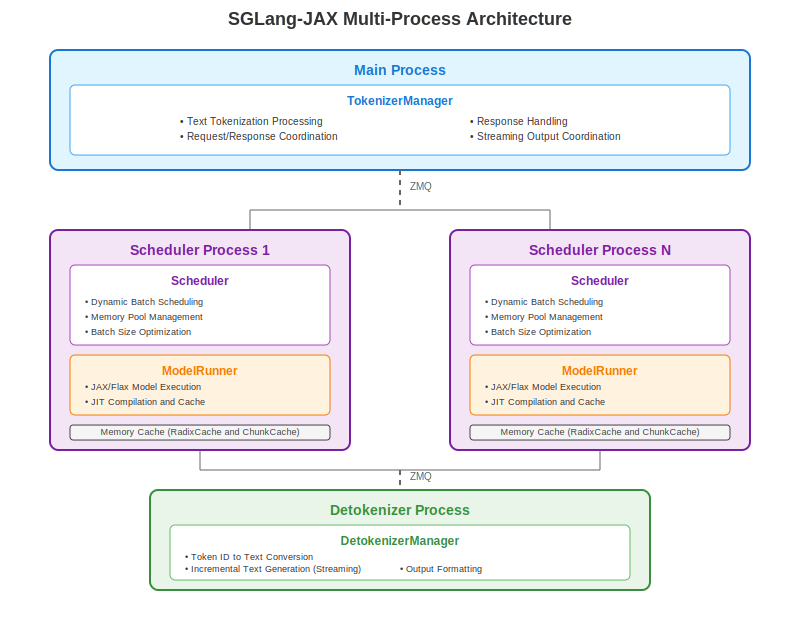

# Project Core Structure

## Overview

SGLang-JAX is a JAX/TPU implementation of the SGLang serving framework, designed for high-performance large language model inference with **full OpenAI API and SGLang interface compatibility**. This document describes the core components, data flow, and key differences compared to the original SGLang project.

## Core Architecture

SGLang-JAX adopts a multi-process architecture with three core components:

1. **TokenizerManager**: Runs in the main process, handles text tokenization
2. **Scheduler**: Runs in a subprocess, manages request scheduling, batching and model forward passes
3. **DetokenizerManager**: Runs in a subprocess, handles output token decoding

### Architecture Diagram

### Data Flow Description

The request processing follows this multi-process pipeline:

1. **Request Ingestion**: HTTP requests arrive at the main process and are parsed by the Engine API

2. **Tokenization**: TokenizerManager converts text to token IDs and coordinates response handling

3. **Scheduling**: Requests are sent via ZMQ to Scheduler processes, which:
   - **Queue Management**: Priority-based waiting queue with FCFS or cache-aware policies
   - **State Transitions**: Handle request lifecycle (waiting → running → finished/aborted)
   - **Memory Management**: Dynamic allocation through RadixCache and ChunkCache with eviction

4. **Batching and Padding**: Scheduler creates batches with:
   - **Dynamic Batch Sizing**: Memory-aware request grouping with optimization
   - **Sequence Padding**: Exponential bucketing for uniform lengths within batches
   - **Position Encoding**: Variable-length sequence position management
   - **Cache Location Mapping**: KV cache allocation and mapping for efficient updates

5. **Model Execution**: ModelRunner processes batches through:
   - **JAX/Flax Forward Passes**: JIT-compiled model execution with shape bucketing
   - **Attention Computation**: FlashAttention or native backends with padding masks
   - **In-place KV Cache Updates**: Pallas kernels for efficient cache management
   - **Logits Generation and Sampling**: Token probability computation and selection

6. **Output Processing**:
   - Token IDs flow back through ZMQ to DetokenizerManager
   - Incremental text decoding (avoids re-decoding entire sequences) with streaming output
   - Streaming response coordination back to clients via TokenizerManager

The architecture supports **multiple concurrent Scheduler processes** for horizontal scaling, each managing independent request batches while sharing the same TokenizerManager and DetokenizerManager infrastructure.

## Key Components

### Entry Points
- **Engine** (`python/sgl_jax/srt/entrypoints/engine.py`): Main inference engine providing Python APIs with full SGLang core interface compatibility
- **HTTP Server** (`python/sgl_jax/srt/entrypoints/http_server.py`): REST API service with **OpenAI API compatibility** and **SGLang API endpoints**, supporting standard chat completions, text completions, and streaming responses

### Managers
- **TokenizerManager** (`python/sgl_jax/srt/managers/tokenizer_manager.py`): Text tokenization and response coordination
- **Scheduler** (`python/sgl_jax/srt/managers/scheduler.py`): Request scheduling and model execution coordination with batching strategies optimized for JIT compilation requirements
- **DetokenizerManager** (`python/sgl_jax/srt/managers/detokenizer_manager.py`): Incremental token-to-text decoding and streaming output

### Model Execution
- **ModelRunner** (`python/sgl_jax/srt/model_executor/model_runner.py`): JAX/Flax model loading and execution with specialized input processing:
  - **Pytree Structure Conversion**: Registers complex data structures like `ForwardBatch` as JAX pytrees to enable JIT compilation
  - **Dynamic Shape Padding**: Applies bucket padding using configurable buckets (e.g., `[64, 128, 256, 512]` for tokens, `[1, 2, 4, 8]` for batch sizes) to handle variable input shapes
  - **Graph-State Separation**: Uses NNX's separation pattern for performance optimization

### Memory Cache
- **RadixCache** (`python/sgl_jax/srt/mem_cache/radix_cache.py`): Prefix caching optimization
- **ChunkCache** (`python/sgl_jax/srt/mem_cache/chunk_cache.py`): Chunk-based cache management
- **ReqToTokenPool** (`python/sgl_jax/srt/mem_cache/memory_pool.py`): Request to token pool mapping management
- **TokenToKVPool** (`python/sgl_jax/srt/mem_cache/memory_pool.py`): KV cache storage with sharded memory layout, supporting MHA and MLA attention architectures. Uses Pallas in-place update kernels to overcome JAX's immutability constraints, ensuring performance doesn't degrade with large KV cache sizes

### Neural Network Layers
- **Attention Backends** (`python/sgl_jax/srt/layers/attention/`): FlashAttention and native attention implementations
- **Sampler** (`python/sgl_jax/srt/layers/sampler.py`): Token sampling for different sampling modes
- **LogitsProcessor** (`python/sgl_jax/srt/layers/logits_processor.py`): Logits processing
- **MoE Layers** (`python/sgl_jax/srt/layers/moe.py`): Mixture of Experts with expert parallelism and static shape optimization
- **Other Layers**: LayerNorm, Linear, Embeddings

### Precompilation System
- **JIT Warm-up**: Precompilation across common batch and sequence length combinations
- **Compilation Cache Monitoring**: Tracks cache performance to ensure zero cache misses

## Differences from SGLang

SGLang-JAX, based on JAX/TPU implementation, has the following differences and challenges compared to the original SGLang:

### 1. **JIT Compilation and XLA Optimization**

JAX uses Just-In-Time compilation with XLA for automatic optimization:
- **Compilation Overhead**: First execution requires compilation time, subsequent runs are fast
- **XLA Optimization**: Automatic kernel fusion, memory layout optimization, and parallel execution
- **Compilation Cache**: Compiled functions are cached based on input shapes and dtypes

**Challenge**: JIT compilation latency can significantly impact serving performance, especially for varied input shapes.

**SGLang-JAX Solution**:
- **Precompilation Strategy**: Models are precompiled with common batch sizes and sequence lengths during server initialization
- **Warm-up Compilation**: Comprehensive compilation warm-up to avoid runtime compilation overhead
- **Shape Bucketing**: Strategic input shape bucketing to minimize compilation variants

### 2. **Functional Programming Model**

JAX enforces functional programming principles for performance and correctness:
- **Pure Functions**: JAX functions must be pure (no side effects)
- **Immutable Data**: All data structures are immutable by design
- **Reproducibility**: Deterministic execution and easy debugging

**Challenge**: LLM serving requires complex state management (model weights, KV cache, request states) which conflicts with immutable, side-effect-free programming.

**SGLang-JAX Solution**:
- **NNX Graph-State Separation**: Uses `nnx.split()` to separate static computation graphs from mutable state, enabling functional JIT compilation of stateful models
- **Functional Cache Threading**: KV cache state passed explicitly as function parameters and return values
- **Pallas In-Place Update Kernels**: Custom Pallas kernels for efficient in-place cache updates, solving performance issues while maintaining JAX compatibility

### 3. **Parallelization Paradigm Differences**

JAX provides sophisticated parallelization capabilities:
- **SPMD Programming**: Single Program Multiple Data execution model
- **Automatic Sharding**: JAX automatically handles tensor sharding across devices
- **Device Mesh**: Flexible device topology for complex parallelization strategies

**Challenge**: Adapting SGLang's parallelization strategies to JAX's sharding-based model while maintaining feature parity.

**SGLang-JAX Solution**:
- **Parallelization Feature Parity**: Successfully implemented tensor parallelism (TP), data-parallel attention (DP-Attn), and expert parallelism (EP) using JAX's sharding paradigm
- **JAX-Native Implementation**: Redesigned parallel execution patterns using PartitionSpec, NamedSharding, and device mesh to achieve equivalent functionality

### 4. **Scheduler Granularity**

JAX's SPMD programming model enables different scheduler deployment strategies:
- **SPMD Execution Model**: Single Program Multiple Data execution with automatic sharding across device meshes
- **Device Mesh Coordination**: JAX manages computation and communication across entire device meshes spanning multiple machines
- **Shard_map Integration**: Data transfer and collective operations are handled through JAX's shard_map primitives within the device mesh

**Challenge**: SGLang deploys one scheduler per chip, but JAX's SPMD model allows more efficient coordination at the machine level.

**SGLang-JAX Solution**:
- **Scheduler Per Machine**: Deploy one scheduler per virtual machine instead of per individual chip, leveraging JAX's SPMD capabilities
- **Device Mesh Management**: Each scheduler coordinates model execution across all devices within its machine using JAX's device mesh abstraction and shard_map for inter-device communication
- **Simplified Architecture**: Reduces scheduler overhead while maintaining full parallelization capabilities through JAX's native collective communication

## Summary

SGLang-JAX represents a specialized implementation of the SGLang framework optimized for the JAX/TPU ecosystem. While it maintains the core architectural principles of SGLang, it offers significant advantages in TPU environments including superior performance, better scalability, and improved cost efficiency. The project focuses on delivering optimal inference performance for TPU workloads while maintaining compatibility with the SGLang API design.
