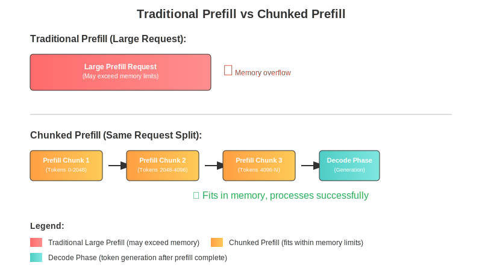

# Chunked Prefill

Chunked prefill is an optimization technique that splits large prefill requests into smaller chunks, enabling efficient batching of prefill and decode requests to maximize GPU utilization and improve inference throughput.

## Goals

The primary objectives of chunked prefill are:

- **Enable Processing of Long Sequences**: Break large prefill requests into smaller, manageable chunks to avoid memory overflow and batch size constraints
- **Improve Memory Management**: Process sequences that would otherwise exceed available memory limits by chunking them into smaller pieces
- **Balance TTFT vs ITL**: Provide configurable trade-offs between Time-to-First-Token (TTFT) and Inter-Token Latency (ITL)

## Design

### Core Concept

Traditional LLM inference processes entire prefill requests as single units, which can cause issues with very long sequences:
- **Prefill phase**: Processes entire input prompt in parallel, but long sequences can exceed memory limits
- **Memory constraints**: Large prefill requests may not fit in available GPU memory or batch size limits

Chunked prefill addresses this by breaking large prefill requests into smaller chunks that can be processed sequentially, allowing the system to handle much longer input sequences without running out of memory.

### Architecture



The diagram illustrates the key difference between traditional and chunked prefill approaches:

- **Traditional Prefill**: Attempts to process the entire large request at once, which may exceed memory limits and cause failures
- **Chunked Prefill**: Breaks the same large request into smaller chunks that can be processed sequentially, ensuring successful completion within memory constraints

### Key Components

1. **ChunkCache**: Simplified cache implementation used when `disable_radix_cache=True`. Unlike RadixCache, it skips complex prefix matching since chunks from the same sequence don't benefit from prefix reuse
2. **Request State Management**: Tracking of chunk boundaries and continuation states across multiple forward passes using `prefix_indices` and `start_send_idx`
3. **Chunk Continuation**: Mechanism to resume processing from where the previous chunk left off

### Memory Management

- Uses `prefix_indices` to track KV cache positions for processed chunks
- Implements continuation mechanism through `init_next_round_input()` method
- Maintains chunk boundaries with `start_send_idx` for incremental KV cache transmission

## Implementation

### Core Classes and Methods

#### ChunkCache (`/python/sgl_jax/srt/mem_cache/chunk_cache.py`)

The `ChunkCache` class provides a simplified cache implementation for chunked prefill scenarios:

```python
class ChunkCache(BasePrefixCache):
    def cache_unfinished_req(self, req: Req):
        # Store KV indices for the processed chunk
        kv_indices = self.req_to_token_pool.req_to_token[
            req.req_pool_idx, : len(req.fill_ids)
        ]
        req.prefix_indices = kv_indices
```

#### Request State Management (`/python/sgl_jax/srt/managers/schedule_batch.py`)

Each request tracks its processing state:

```python
class Req:
    start_send_idx: int = 0  # Start index for KV cache transmission

    def init_next_round_input(self, tree_cache: Optional[BasePrefixCache] = None):
        self.fill_ids = self.origin_input_ids + self.output_ids
        # Match prefix and calculate extension length
        self.extend_input_len = len(self.fill_ids) - len(self.prefix_indices)
```

#### Scheduling Policy (`/python/sgl_jax/srt/managers/schedule_policy.py`)

The `PrefillAdder.add_chunked_req()` method handles chunk processing:

```python
def add_chunked_req(self, req: Req):
    # Determine if request needs truncation
    truncated = req.extend_input_len > self.rem_chunk_tokens

    # Truncate to available chunk size
    req.extend_input_len = min(req.extend_input_len, self.rem_chunk_tokens)
    req.fill_ids = req.fill_ids[: len(req.prefix_indices) + req.extend_input_len]

    # Add to batch and update budgets
    self.can_run_list.append(req)

    # Return continuation request if truncated
    return req if truncated else None
```

#### Scheduler Integration (`/python/sgl_jax/srt/managers/scheduler.py`)

The main scheduler handles chunked request continuation:

```python
# Process continuing chunked request
if self.chunked_req is not None:
    self.chunked_req.init_next_round_input()
    self.chunked_req = adder.add_chunked_req(self.chunked_req)

# Handle new chunked requests from batch processing
if adder.new_chunked_req is not None:
    assert self.chunked_req is None
    self.chunked_req = adder.new_chunked_req
```

### Configuration

Chunked prefill is controlled by the `chunked_prefill_size` parameter in `ServerArgs`:

```python
# Default chunk size
chunked_prefill_size: Optional[int] = None  # Defaults to 4096

# Initialization logic
if self.chunked_prefill_size is None:
    self.chunked_prefill_size = 4096
```

When `chunked_prefill_size` is set and `disable_radix_cache=True`, the system uses `ChunkCache` instead of `RadixCache`.

## Usage

### Basic Configuration

Enable chunked prefill by setting the chunk size in server arguments:

```bash
python -m sgl_jax.launch_server \
    --model-path Qwen/Qwen-7B \
    --chunked-prefill-size 2048 \
    --disable-radix-cache \
    --mem-fraction-static 0.8
```

### Parameter Tuning

**Chunk Size Selection**:
- **Default**: 4096 tokens provides good balance for most workloads
- **Adjustment**: Tune based on your specific memory constraints and sequence length requirements

**Memory Configuration**:
- Use with `--disable-radix-cache` to enable ChunkCache, which avoids prefix matching overhead since chunks from the same sequence don't benefit from prefix caching
- Adjust `--mem-fraction-static` based on expected sequence lengths
- Monitor `--max-prefill-tokens` to avoid OOM with large chunks


### Monitoring and Testing

Use the provided test to validate chunked prefill functionality:

```python
# From test/srt/test_chunked_prefill_size.py
python -m pytest test/srt/test_chunked_prefill_size.py
```

The test launches a server with:
- Chunk size: 2048 tokens
- Memory fraction: 0.2
- Validates MMLU evaluation performance

### When to Use

Use chunked prefill when you encounter out-of-memory errors with long input sequences or need to process sequences that exceed your system's memory limits.
