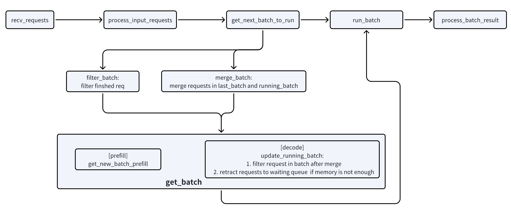

# Dynamic Continuous Batching

## Goals

Dynamic continuous batching in SGLang JAX is designed to maximize throughput and efficiency for large language model inference by dynamically managing request lifecycles and memory allocation. The core objectives are:

- **Dynamic Request Management**: Add new requests and remove completed ones from batches without waiting for the entire batch to finish
- **Memory Efficiency**: Optimize KV cache usage with intelligent allocation and eviction strategies
- **Throughput Maximization**: Maintain high TPU utilization by continuously processing requests of varying lengths

## Design

SGLang JAX implements dynamic continuous batching through a sophisticated multi-layer architecture that separates concerns between scheduling, execution, and memory management.

### Core Architecture

The system follows a three-tier batch transformation pipeline:

```
ScheduleBatch -> ModelWorkerBatch -> ForwardBatch
```

- **ScheduleBatch**: High-level scheduling data managed by the Scheduler, primarily CPU-based
- **ModelWorkerBatch**: Subset of ScheduleBatch containing model forward data
- **ForwardBatch**: Low-level array data for model execution, primarily TPU arrays

### Memory Management

Dynamic batching is enabled by sophisticated memory management:

#### Token Allocation
- **Request To Token Pool**: Maps requests to token indices for tracking sequence locations
- **Token To KV Pool**: Manages KV cache storage with page-based allocation
- **Page Based Allocation**: Configurable page sizes for efficient memory utilization

#### Cache Management
- **Radix Cache**: Tree-based prefix caching to avoid recomputing shared prefixes

### Scheduler workflow




## Implementation

### Request Lifecycle

#### 1. Request Processing

```python
def handle_generate_request(self, recv_req: TokenizedGenerateReqInput):
    # Create new request with validation
    req = Req(recv_req.rid, recv_req.text, recv_req.input_ids, recv_req.sampling_params, ...)

    # Validate input length and parameters
    error_msg = validate_input_length(req, self.max_req_input_len, self.server_args.allow_auto_truncate)

    # Add to waiting queue
    self._add_request_to_queue(req)
```

#### 2. Batch Assembly

The scheduler dynamically assembles batches using the `PrefillAdder`:

```python
def get_new_batch_prefill(self) -> Optional[ScheduleBatch]:
    # Create prefill adder with resource constraints
    adder = PrefillAdder(
        self.page_size, self.tree_cache, self.token_to_kv_pool_allocator,
        self.running_batch, self.new_token_ratio, self.max_prefill_tokens,
        self.chunked_prefill_size
    )

    # Add requests until resource limits
    for req in self.waiting_queue:
        res = adder.add_one_req(req)
        if res != AddReqResult.CONTINUE:
            break
```

#### 3. Memory Allocation

##### Extend Mode Allocation
```python
def prepare_for_extend(self):
    # Allocate request slots
    req_pool_indices = self.alloc_req_slots(bs)

    # Handle prefix caching
    for req in reqs:
        if pre_len > 0:
            self.req_to_token_pool.write(
                (req.req_pool_idx, slice(0, pre_len)),
                prefix_indices_device
            )

    # Allocate memory based on page size
    if self.token_to_kv_pool_allocator.page_size == 1:
        out_cache_loc = self.alloc_token_slots(extend_num_tokens)
    else:
        out_cache_loc = self.alloc_paged_token_slots_extend(
            prefix_lens_device, seq_lens_device, last_loc, extend_num_tokens
        )
```

##### Decode Mode Allocation
```python
def prepare_for_decode(self):
    # Update sequence lengths
    self.seq_lens = jnp.add(self.seq_lens, 1)

    # Allocate memory for new tokens
    if self.token_to_kv_pool_allocator.page_size == 1:
        self.out_cache_loc = self.alloc_token_slots(bs)
    else:
        self.out_cache_loc = self.alloc_paged_token_slots_decode(
            self.seq_lens, last_loc
        )
```

#### 4. Batch Merging and Filtering

The system supports dynamic batch modification:

```python
def merge_batch(self, other: "ScheduleBatch"):
    # Merge sampling information
    self.sampling_info.merge_batch(other.sampling_info, other.mesh)

    # Concatenate array
    self.req_pool_indices = jnp.concat([self.req_pool_indices, other.req_pool_indices])
    self.seq_lens = jnp.concat([self.seq_lens, other.seq_lens])
    self.reqs.extend(other.reqs)

def filter_batch(
    self,
    chunked_req_to_exclude: Optional[Union[Req, List[Req]]] = None,
    keep_indices: Optional[List[int]] = None):
    # Remove finished requests
    if keep_indices is None:
        keep_indices = [i for i in range(len(self.reqs)) if not self.reqs[i].finished()]

    # Update arrays and request lists
    self.reqs = [self.reqs[i] for i in keep_indices]
    self.req_pool_indices = self.req_pool_indices[keep_indices_device]
    self.seq_lens = self.seq_lens[keep_indices_device]
```


## Usage

### Configuration

Configure dynamic continuous batching through server arguments:
- `--max-running-requests`
- `--page-size`

The dynamic continuous batching system in SGLang JAX provides a robust foundation for efficient LLM serving, automatically adapting to varying workloads while maximizing resource utilization and minimizing latency.
