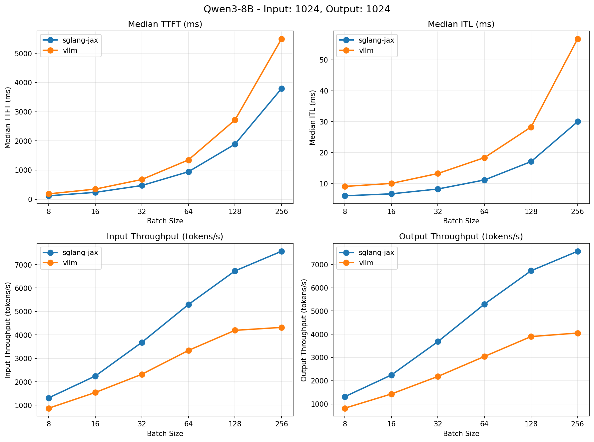
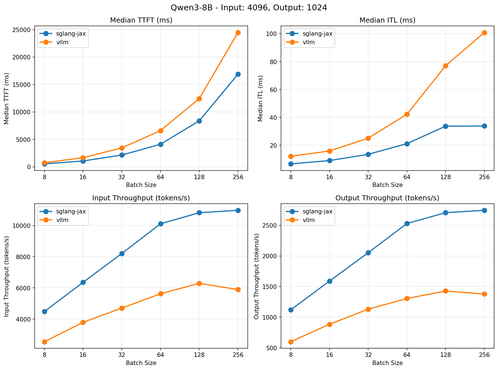
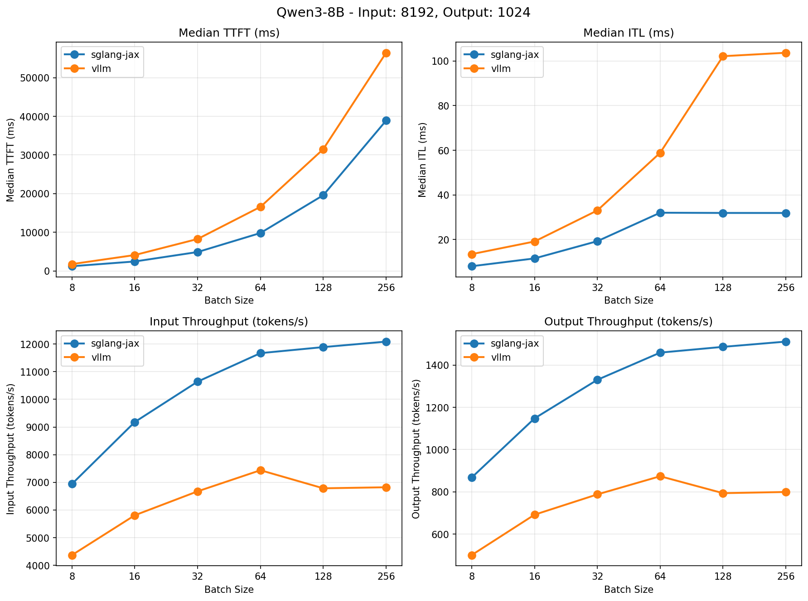
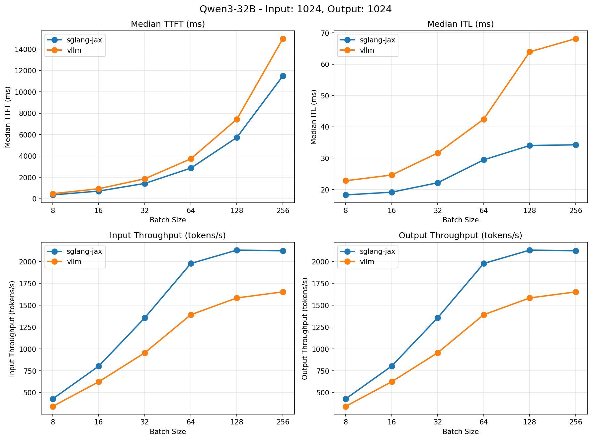
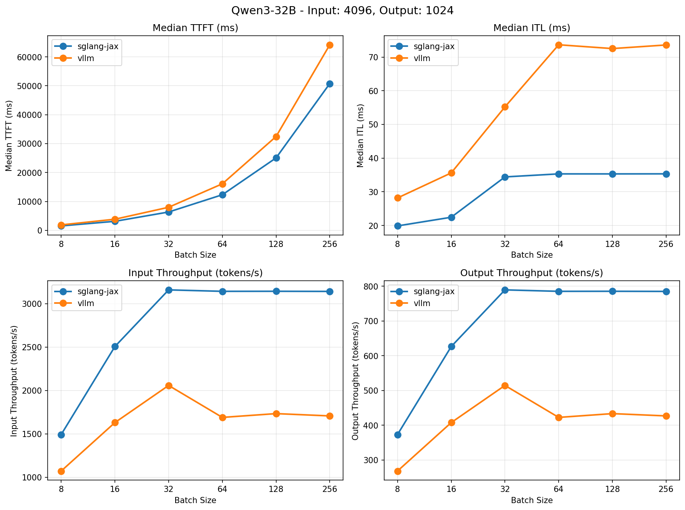
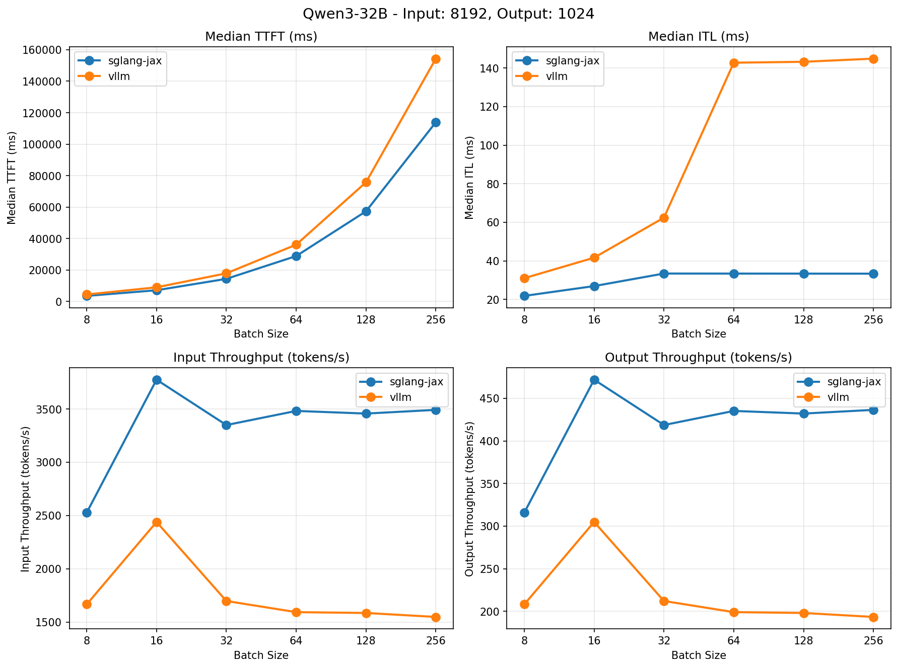

# Performance Benchmark Results

This document presents comprehensive performance benchmark results comparing different inference frameworks with various model configurations.

## Test Configuration

- **Test Date**: September 12, 2025
- **Test Environment**: TPU-v6e-4
- **Models**: Qwen3-8B, Qwen3-32B
- **Frameworks Compared**: SGLang-JAX vs vLLM
- **Framework Versions**:
  - **SGLang-JAX**: main-10f32e49ab19f54fa393a2564c0ea0b6a78bc967
  - **vLLM**: main-5931b7e5d9acd4fd9eb42d56086c379fa2e2014e
- **Output Length**: 1, 1024 tokens
- **Input Lengths**: 1024, 4096, 8192 tokens
- **Batch Sizes**: 8, 16, 32, 64, 128, 256

### Methodology Note

**TTFT (Time to First Token) Measurement**: For more accurate TTFT metrics, measurements were taken using `output_len=1` test runs. This approach minimizes the impact of generation overhead and provides a more precise measurement of the actual time to produce the first token.

**Other Metrics**: ITL (Inter-Token Latency) and throughput metrics were measured using `output_len=1024` to reflect realistic workload performance characteristics.

### Server Startup Commands

**SGLang-JAX Server:**
```bash
# Set MODEL_NAME to Qwen/Qwen3-8B or Qwen/Qwen3-32B
MODEL_NAME="Qwen/Qwen3-8B"  # or "Qwen/Qwen3-32B"

JAX_COMPILATION_CACHE_DIR=/tmp/jit_cache \
python3 -u -m sgl_jax.launch_server \
--model-path ${MODEL_NAME} \
--trust-remote-code \
--tp-size=4 \
--device=tpu \
--mem-fraction-static=0.8 \
--chunked-prefill-size=2048 \
--download-dir=/tmp \
--dtype=bfloat16 \
--max-running-requests 256 \
--skip-server-warmup \
--page-size=128 \
--disable-radix-cache
```

**vLLM Server:**
```bash
# Set MODEL_NAME to Qwen/Qwen3-8B or Qwen/Qwen3-32B
MODEL_NAME="Qwen/Qwen3-8B"  # or "Qwen/Qwen3-32B"

vllm serve "${MODEL_NAME}" \
--download_dir /tmp \
--swap-space 16 \
--disable-log-requests \
--tensor_parallel_size=4 \
--trust-remote-code \
--max-model-len=9216 \
--no-enable-prefix-caching
```

## Qwen3-8B Performance Results

### Performance Overview







### Detailed Performance Data

| ISL/OSL | Batch Size | TTFT(ms)_SGL_JAX | TTFT(ms)_vLLM | ITL(ms)_SGL_JAX | ITL(ms)_vLLM | Input_Throughput(tok/s)_SGL_JAX | Input_Throughput(tok/s)_vLLM | Output_Throughput(tok/s)_SGL_JAX | Output_Throughput(tok/s)_vLLM |
|--------------|------------|------------|------------|------------|------------|------------|------------|------------|------------|
| 1024/1024 | 8 | 117.55 | 183.57 | 5.99 | 9.02 | 1311.49 | 871.40 | 1311.49 | 815.38 |
| 1024/1024 | 16 | 234.88 | 345.81 | 6.62 | 9.98 | 2243.06 | 1541.83 | 2243.06 | 1427.84 |
| 1024/1024 | 32 | 469.26 | 675.75 | 8.18 | 13.20 | 3682.22 | 2319.11 | 3682.22 | 2183.37 |
| 1024/1024 | 64 | 940.87 | 1346.38 | 11.11 | 18.34 | 5296.60 | 3337.44 | 5296.60 | 3043.58 |
| 1024/1024 | 128 | 1885.82 | 2716.48 | 17.06 | 28.25 | 6731.67 | 4195.94 | 6731.67 | 3900.00 |
| 1024/1024 | 256 | 3793.50 | 5496.67 | 30.00 | 56.81 | 7571.84 | 4320.85 | 7571.84 | 4051.08 |
| 4096/1024 | 8 | 523.78 | 729.73 | 6.61 | 12.05 | 4477.33 | 2542.74 | 1119.33 | 598.59 |
| 4096/1024 | 16 | 1057.61 | 1656.71 | 9.00 | 15.85 | 6354.77 | 3788.42 | 1588.69 | 883.27 |
| 4096/1024 | 32 | 2139.54 | 3447.90 | 13.48 | 25.04 | 8206.54 | 4704.65 | 2051.63 | 1130.40 |
| 4096/1024 | 64 | 4108.43 | 6594.65 | 21.13 | 42.20 | 10115.17 | 5621.33 | 2528.79 | 1304.04 |
| 4096/1024 | 128 | 8369.21 | 12434.49 | 33.68 | 77.03 | 10824.54 | 6292.28 | 2706.13 | 1426.83 |
| 4096/1024 | 256 | 16892.56 | 24489.54 | 33.78 | 100.87 | 10978.87 | 5888.17 | 2744.72 | 1376.88 |
| 8192/1024 | 8 | 1202.65 | 1754.79 | 7.98 | 13.40 | 6941.47 | 4370.66 | 867.68 | 500.85 |
| 8192/1024 | 16 | 2431.33 | 4096.75 | 11.48 | 19.08 | 9180.14 | 5809.26 | 1147.52 | 691.81 |
| 8192/1024 | 32 | 4876.89 | 8250.31 | 19.22 | 33.01 | 10640.91 | 6674.53 | 1330.11 | 787.90 |
| 8192/1024 | 64 | 9797.87 | 16565.67 | 31.98 | 58.86 | 11670.14 | 7437.75 | 1458.77 | 873.82 |
| 8192/1024 | 128 | 19583.63 | 31509.04 | 31.88 | 102.19 | 11888.43 | 6784.33 | 1486.05 | 793.81 |
| 8192/1024 | 256 | 38895.87 | 56454.02 | 31.87 | 103.73 | 12086.94 | 6821.50 | 1510.87 | 799.38 |

## Qwen3-32B Performance Results

### Performance Overview







### Detailed Performance Data

| ISL/OSL | Batch Size | TTFT(ms)_SGL_JAX | TTFT(ms)_vLLM | ITL(ms)_SGL_JAX | ITL(ms)_vLLM | Input_Throughput(tok/s)_SGL_JAX | Input_Throughput(tok/s)_vLLM | Output_Throughput(tok/s)_SGL_JAX | Output_Throughput(tok/s)_vLLM |
|--------------|------------|------------|------------|------------|------------|------------|------------|------------|------------|
| 1024/1024 | 8 | 356.59 | 469.74 | 18.29 | 22.81 | 427.69 | 342.46 | 427.69 | 342.46 |
| 1024/1024 | 16 | 715.11 | 933.90 | 19.16 | 24.63 | 803.46 | 623.96 | 803.46 | 623.96 |
| 1024/1024 | 32 | 1429.91 | 1868.16 | 22.17 | 31.66 | 1355.93 | 955.96 | 1355.93 | 955.96 |
| 1024/1024 | 64 | 2864.06 | 3734.00 | 29.48 | 42.45 | 1977.45 | 1391.29 | 1977.45 | 1391.29 |
| 1024/1024 | 128 | 5732.96 | 7442.95 | 34.05 | 63.94 | 2130.61 | 1583.09 | 2130.61 | 1583.09 |
| 1024/1024 | 256 | 11500.61 | 14985.60 | 34.27 | 68.14 | 2122.98 | 1652.79 | 2122.98 | 1652.79 |
| 4096/1024 | 8 | 1557.02 | 1910.64 | 19.88 | 28.18 | 1492.67 | 1072.84 | 373.17 | 268.21 |
| 4096/1024 | 16 | 3145.14 | 3869.19 | 22.45 | 35.61 | 2505.69 | 1630.30 | 626.42 | 407.57 |
| 4096/1024 | 32 | 6364.04 | 7998.06 | 34.42 | 55.21 | 3157.80 | 2057.92 | 789.45 | 514.48 |
| 4096/1024 | 64 | 12329.34 | 16108.16 | 35.32 | 73.64 | 3141.21 | 1690.00 | 785.30 | 422.50 |
| 4096/1024 | 128 | 25060.27 | 32453.86 | 35.32 | 72.52 | 3141.75 | 1733.57 | 785.44 | 433.39 |
| 4096/1024 | 256 | 50766.15 | 64171.18 | 35.34 | 73.58 | 3140.25 | 1707.17 | 785.06 | 426.79 |
| 8192/1024 | 8 | 3510.68 | 4414.04 | 21.85 | 31.04 | 2527.24 | 1665.42 | 315.90 | 208.18 |
| 8192/1024 | 16 | 7105.47 | 8973.12 | 26.94 | 41.67 | 3775.36 | 2439.44 | 471.92 | 304.93 |
| 8192/1024 | 32 | 14355.59 | 17856.06 | 33.45 | 62.43 | 3349.42 | 1697.07 | 418.68 | 212.13 |
| 8192/1024 | 64 | 28849.51 | 36082.81 | 33.43 | 142.77 | 3482.01 | 1592.38 | 435.25 | 199.05 |
| 8192/1024 | 128 | 57299.20 | 75751.47 | 33.41 | 143.24 | 3457.24 | 1584.61 | 432.16 | 198.08 |
| 8192/1024 | 256 | 113927.80 | 154356.17 | 33.38 | 144.88 | 3492.01 | 1547.29 | 436.50 | 193.41 |

## Benchmark Testing Script

The following script was used to generate the benchmark results:

```bash
#!/bin/bash

set -e

if [ -z "$1" ]; then
  echo "Usage: $0 <engine>"
  echo "engine: sgl-jax or vllm"
  exit 1
fi

backend=${1}
num_prompts_per_concurrency=3
input_seq_lens=(1024 4096 8192)
output_seq_lens=(1 1024)
max_concurrencies=(8 16 32 64 128 256)

for input_seq_len in "${input_seq_lens[@]}"; do
  for output_seq_len in "${output_seq_lens[@]}"; do
    for max_concurrency in "${max_concurrencies[@]}"; do
        num_prompts=$((num_prompts_per_concurrency * max_concurrency))
        python3 -m sgl_jax.bench_serving \
          --backend ${backend} \
          --dataset-name random \
          --num-prompts ${num_prompts} \
          --random-input ${input_seq_len} \
          --random-output ${output_seq_len} \
          --max-concurrency ${max_concurrency} \
          --random-range-ratio 1 \
          --warmup-requests 0
    done
  done
done
```

### Usage Instructions

1. **Save the script** to a file (e.g., `benchmark.sh`) and make it executable:
   ```bash
   chmod +x benchmark.sh
   ```

2. **Start the server** first using the appropriate startup command from above for your chosen model.

3. **Run the benchmark** for SGLang-JAX:
   ```bash
   ./benchmark.sh sgl-jax
   ```

4. **Run the benchmark** for vLLM:
   ```bash
   ./benchmark.sh vllm
   ```

**Note**: The script will test all combinations of:
- Input sequence lengths: 1024, 4096, 8192 tokens
- Output sequence lengths: 1, 1024 tokens
- Batch sizes (max concurrency): 8, 16, 32, 64, 128, 256
- 3 prompts per concurrency level

Each test run will generate detailed performance metrics including TTFT, ITL, and throughput measurements.
